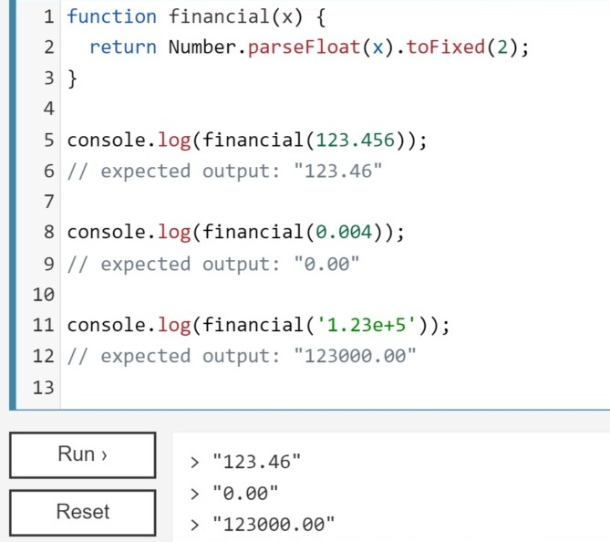

# Stock Purchase - Profit or Loss


## Main tag
The `<main>` HTML element represents the primary content of a document's body. 
The main content area contains content that is directly related to or expands on a document's central topic or an application's central functionality.
- Eg: 

    

<br>
</br>

## for in label
The HTML element `<label>` represents a caption for a user interface item.
To associate the `<label>` with an `<input>` element, add an id attribute to the `<input>`. The `<label>` then requires a for attribute with the same value as the input's id.
- Eg:

    

<br>
</br>

## Modular Programming
It is basically a software design technique which emphasises separating a program's functionality into independent, interchangeable modules.
- This assures that each function can be independently executed.
- This helps in easy debugging and makes the code easier to read.

<br>
</br>

## console.log()
outputs a message to the web console.
- Syntax:
    ```
    console.log(obj1 [, obj2, ..., objN]);
    console.log(msg [, subst1, ..., substN]);
    ```
<br>
</br>

## tofixed() 
method formats a number using fixed-point notation.

- Syntax:
    ```
    toFixed() 
    ```

- Eg:

    

<br>
</br>

## accessing css styles in Js
The `style` read-only property returns the inline style of an element in the form of a CSSStyleDeclaration object that contains a list of all styles properties for that element with values assigned for the attributes that are defined in the element's inline style attribute.

- Syntax:
    ```
    style = element.style
    ```
- Eg:
    ```
    element.style.backgroundColor = "red"
    ```
<br>
</br>

## *Know more*
[toFixed](https://developer.mozilla.org/en-US/docs/Web/JavaScript/Reference/Global_Objects/Number/toFixed)

[Accessing css styles in js](https://developer.mozilla.org/en-US/docs/Web/API/HTMLElement/style)


