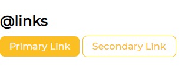

# **Getting started with HTML5**
In this document, along with the concepts, we will also address some keywords used in HTML.
## Introduction to HTML5
### [**HTML**](https://developer.mozilla.org/en-US/docs/Web/HTML) stands for **HyperText Markup Language**. It allows the modification and adjustments of the appearance of  web pages. It is responsible for layout the structure of the web page.

- Here, **HyperText** means a text which contains links to other texts and **Markup Language** is a computer language that uses tags to define elements within a document.

***HTML and CSS are not programming, they are more about using high level tokens used to show that how the page should look like***

## Semantic HTML
- In programming, **Semantic** refers to the *meaning* of the code. It tells that what is the purpose of this piece of code 
    -  Eg. `<h1>` tag is used to write the main heading of the webpage
	So the data written within this tag then it is understood that it is the main title.
- But in case of `<div>`, it is used wrap flow content. It has no effect on the content. It is a **non-Semantic** tag.


## HTML **`<head>` tag** vs **`<body>` tag**
- In `<head>` tag we mention the code which is not to be displayed on the web page. It includes information about the page, **metadata** (data about data) and how to process it. It is the first section of the HTML document
- In `<body` tag we mention the contents which is to be displayed on the page, the **actual content**. It is the second section of the HTML document

## Component Library
- Component library is a set of reusable components.
- It can be a folder where the codes for components will be stored which are common throughout the application or used frequently in the application.

### Typography
- Here's a glossary of the appearance of texts when wrapped around respective tags

    - `<h1>` to `<h6>` -- **heading tags** <br />
        These tags are used to wrap headings according to their priorities.
        - eg. The largest heading will be written within `<h1>` tag and the smallest heading will be written within `<h6>` tag<br /><br />

    - `<p>` -- **paragraph tag** <br />
        It defines a paragraph of text<br /><br />

    - `<strong>` -- **strong tag** <br />
        It indicates the browser that the wrapped content is to be strongly emphasized, hence, changes the font-weight of the wrapped text to **bold**<br /><br />
    
    - `<i>` -- **i tag** <br />
        It changes the font-style of the wrapped text to *italics*<br /><br />

    - `<small>` -- **small tag** <br />
        It changes the font-size of the wrapped text to to a relatively smaller size<br /><br />

        
        
### Container
- The Container is used for storing a group of inter-related content of the document which shares same background-color, font-color, font-size, font-family, etc.
- Container is a space which don’t have a meaning

    


### Links
- Anything that connects us to different page is link and web browser has many links.
- We use anchor tag and href attribute for specifying link <br/>
```
<a href="/">primary link</a> 
```
- Two types of links: 
    - Primary link -> important link that we want user to click.
    - Secondary link -> not so important link that user can click or not.<br /><br />
    

### Inline Element Vs Block Element
- In Html, we basically lay bricks .i.e. we write the code in sequential manner.
- <code>Block Element</code> - The element/tag which occupies whole row is called as block element.
    - Example: ` <h1>,<p> `
- <code>Inline Element</code> - The element/tag which occupies only the space required by the content is called as an inline element.
    - Example: ` <small>,<span> `<br/><br />
    
    
### Lists 
- HTML Lists are used to specify lists of information. All lists may contain one or more list elements.
- There are three different types of HTML lists.
    1. unordered list <br />
    The `<ul>` tag defines an unordered (bulleted) list.  
        ```
        <ul>
            <li> Item One</li>
            <li> Item Two</li>
            <li> Item Three</li>
        </ul>
        ```
        
    2. unordered inline <br />
    The `display` style of the unordered list items is changed to inline
        ```
        <ul style="display: inline;">
            <li> Inline Item One</li>
            <li> Inline Item Two</li>
            <li> Inline Item Three</li>
        </ul>
        ``` 
        
    3. reverse ordered <br />
    The list is an ordered list but displayed in a reverse manner by adding the attribute `reversed`
        ```
        <ol reversed>
            <li> Item One</li>
            <li> Item Two</li>
            <li> Item Three</li>
        </ol>
        ``` 
        

### Nav
- It is a navigation component from where we can navigate to other pages of website.
- We use `<nav>` tag to specify the browser that the links present in navigation are important
- To add links in nav, we use `anchor tag`.


### Header
- `Header` specifies the main heading/title of a web page.
- It is also called as `Hero`.
- Header has semantic component `<header> tag`
- We can add an image in header.
- For adding an image we use ` tag` and it is a self closing tag.
- `src` is  the source attribute for specifying image link that we use in image tag.
```

```


### Section
- `<section>` tag specifies that a web page has different parts/sections in it.
- `Section` can have heading, paragraph, article , or anything.
- Example:
    - `White section` -> a section that have a white background color.
    - `Off-white section` -> a section that have a gray background color.<br /><br />
    

### Footer
- `Footer` specifies the footer element in web page.
- It may consists of social media links,contact information,copyright information, etc.
- For footer, we use `<footer>` tag.
- Inside a `footer tag` we can specify a `header`, `list` for important links, etc.<br/>


## Tips & Tricks:
### For images
- Use `.svg` image file for websites as it will be more efficient and will not be blurred when zoomed in.
- Can use `.png` image file for blogs.
- We can use any image from internet but should keep in mind about the **copyright issues**.
- The images that will be used in your website should not contain any copyright issues.
- The source to be specified in image tag can be an absoulte URL or a relative URL.
    - `Absoulte URL` -> These links us to an external image that is hosted on another website.
    - `Relative URL` -> These links us to an image that is hosted within the website.
## Resources
- [HTML | HyperText Markup Language](https://developer.mozilla.org/en-US/docs/Web/HTML)
- [Semantic HTML](https://developer.mozilla.org/en-US/docs/Glossary/Semantics#semantics_in_html)
- [What's in the head? Metadata in HTML](https://developer.mozilla.org/en-US/docs/Learn/HTML/Introduction_to_HTML/The_head_metadata_in_HTML)
- [`<body>` tag in the document](https://developer.mozilla.org/en-US/docs/Web/HTML/Element/body)
