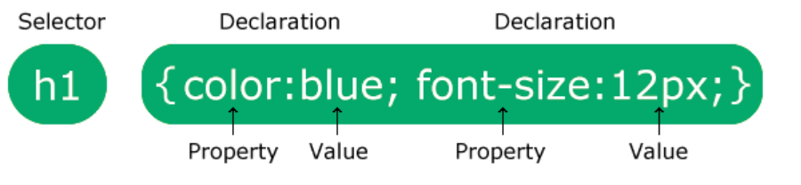
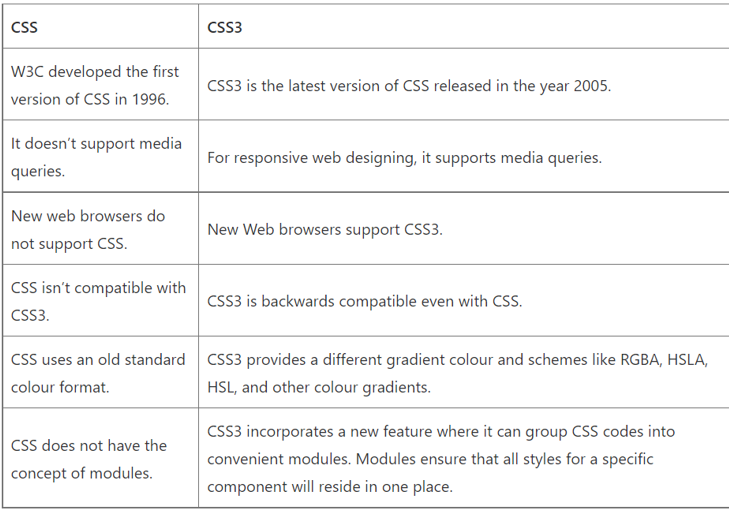
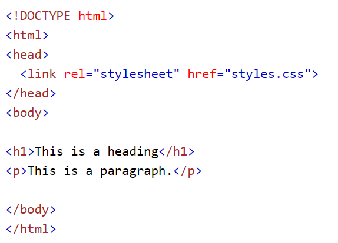
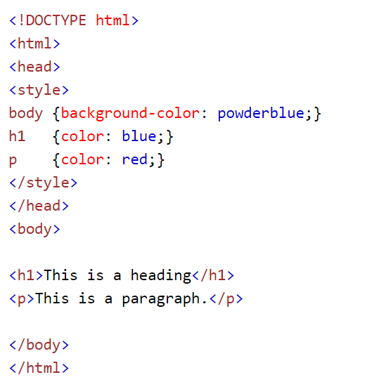
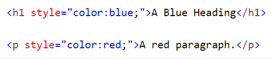
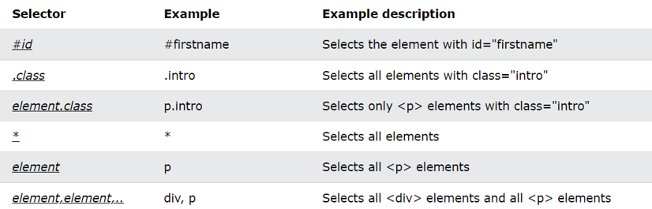
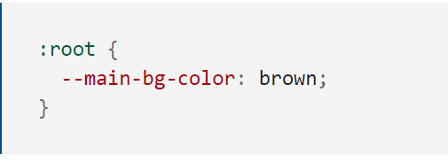
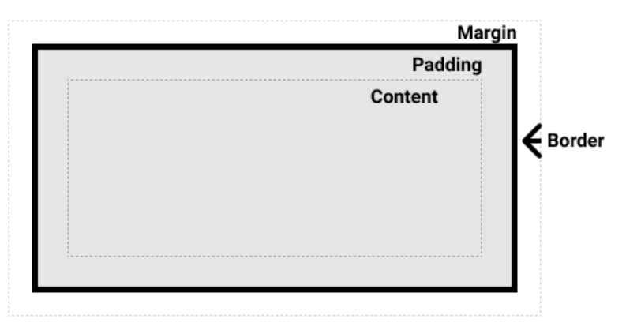
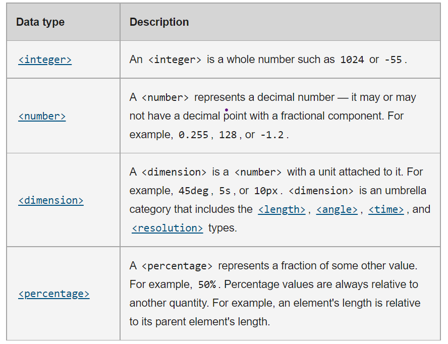
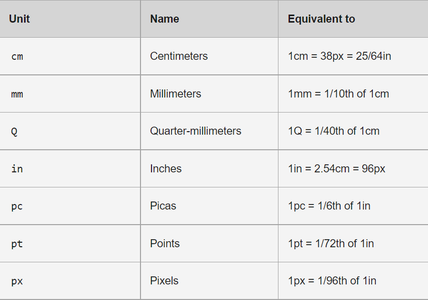

# 
**Getting started with CSS3**

&nbsp;

# ABOUT CSS3
- Cascading style sheet is something that helps an html page look better and attractive, basically designing web pages.
- It works in conjunction with HTML to provide a nice look, style, and structure to the program. 
- The latest version of CSS is CSS3.
  
><h3>CSS Syntax:</h3>

 

  

><h3>Difference between CSS and CSS3</h3> 

 

&nbsp;

# WAYS TO INCLUDE CSS
><h3>External css</h3>

- Make a separate  .css file and then link it to the html file.

  

><h3>Internal css</h3>

- Inside the head tag of the html file, create a style tag and write down the css properties and put an end tag of style.

><h3>Inline css</h3>

- Inside a tag to which the property has to be applied.

  

><h3>WHICH WAY IS THE IDEAL ONE?</h3>

External css is the best practice to be followed, as it makes changing and accessing the css property easy and also allows reusability.

&nbsp;

# SELECTORS IN CSS
- CSS selectors are used to "find" (or select) the HTML elements you want to style.
- We can divide CSS selectors into five categories:
1. Simple selectors (select elements based on name, id, class)
2. Combinator selectors (select elements based on a specific relationship between them)
3. Pseudo-class selectors (select elements based on a certain state)
4. Pseudo-elements selectors (select and style a part of an element)
5. Attribute selectors (select elements based on an attribute or attribute value)
 
 
 
- Group selector:
To group selectors, separate each selector with a comma.
 
example: 
<pre>
p,h1,h3{
    color:red;
}
</pre>

_Resource:_ https://www.w3schools.com/css/css_selectors.asp

&nbsp;

# PROPERTIES IN CSS
There are many CSS properties but a few that are commonly used are:

><h4>Background-color</h4>

Sets the background color of an element
 

Syntax :
<pre>
 background-color: red;
 </pre>

><h4>Border</h4>

It sets an element's border. It sets the values of border-width, border-style, and border-color.
 

 Syntax :
 <pre>
/* style */
border: solid;

/* width | style */
border: 2px dotted;

/* style | color */
border: outset #f33;

/* width | style | color */
border: medium dashed green;
</pre>

><h4>Color</h4>

Property sets the color value of an element's text
 

Syntax :
<pre>
color: red;
</pre>

><h4>Font</h4>

Sets all the different properties of an element's font like font-style, font-weight, font-size, line-height font-family,etc
 

Syntax :
<pre>
font-family: Georgia, serif;

font-size: 1.2em;

font-style: italic;

font-weight: bold;

line-height: 2.5;
</pre>
><h4>Padding</h4>

Sets the padding area on all four sides of an element at once. An element's padding area is the space between its content and its border.

Syntax :
<pre>
/* Apply to all four sides */
padding: 1em;

/* vertical | horizontal */
padding: 5% 10%;

/* top | horizontal | bottom */
padding: 1em 2em 2em;
 
/* top | right | bottom | left */
padding: 5px 1em 0 2em;
</pre>
 
><h4>text-decoration </h4>

Sets the appearance of decorative lines on text.

Syntax :
<pre>
text-decoration: underline;

text-decoration: underline dotted;
</pre>
><h4>text-align</h4>

Sets the horizontal alignment of the content inside a block element or table-cell box

Syntax :
<pre>
text-align: start;

text-align: end;

text-align: left;

text-align: right;

text-align: center;
</pre>
><h4>margin</h4>

sets the margin area on all four sides of an element.

Syntax :
<pre>
/* Apply to all four sides */
margin: 1em;

/* vertical | horizontal */
margin: 5% auto;

/* top | horizontal | bottom */
margin: 1em auto 2em;

/* top | right | bottom | left */
margin: 2px 1em 0 auto;
 </pre>
><h4>display</h4>

Sets whether an element is treated as a block or inline element and the layout used for its children, such as flow layout, grid or flex.

Syntax :
<pre>
display: block;

display: inline;

display: inline-block;

display: flex;

display: inline-flex;

display: grid;
</pre>

&nbsp;

# CSS VARIABLES 
- CSS variables are custom properties in CSS. 
- These variables are set once and then their values can be used throughout the document.
- CSS variable names are case sensitive

><h3>How are CSS variables defined?</h3>
custom properties should be defined on the <a href=”https://developer.mozilla.org/en-US/docs/Web/CSS/:root”>: root</a> pseudo-class so that it can be 
applied across your HTML document.   

><h3>How to access CSS variables?</h3>

You can access the value of the CSS variable by specifying the name of the variable 
inside the var() function in place of a regular property value.

  

_Resource:_  https://developer.mozilla.org/en-US/docs/Web/CSS/Using_CSS_custom_properties

&nbsp;

# CSS BOX MODEL
Everything in CSS has a box around it. The CSS box model is all about MBPC i.e margin, border, padding, content.

  
<h3>Understanding the parts of CSS box model:</h3>
 

><h3>Margin</h3>
-  Margin is the outermost section that wraps the content, padding and border. margin is defined using margin and related properties.

><h3>Content <h3>
-  This is the area where the content or text gets displayed

><h3>Padding</h3>
- It creates space around an element’s content. It’s size can be controlled using padding and related properties.

><h3>Border</h3>
- A border that wraps the content and padding. It can be styled using the border property.

&nbsp;

# CSS UNITS 
Frequently encountered css units are : Numbers, lengths and percentages.

><h3>Numbers</h3>
 

 
 

><h3>Lengths</h3>
There are two types of lengths used in CSS — relative and absolute

- Absolute length units
They are not relative to anything else, and are generally considered to always be the same size.

 

 

- Relative length units
Relative length units are relative to something else, perhaps the size of the parent element's font, or the size of the viewport. 

&nbsp;

# CSS INSPECT ELEMENTS 
><h3>Where is the inspect and what is it for?</h3>

- When you right-click on any web page, there is an inspect option
 
- It gives all the info about any element on the page., _(if we find anything really good and useful for our project work, we can just inspect and grab that piece of code)_

- It also helps to debug the code.

&nbsp;

# COMMENTS IN CSS
- Comments are used to explain the code, and may help when you edit the source code at a later date.

- A comment in css starts with /* and ends with */

&nbsp;

# OVERRIDING CSS
If a property is defined twice, the latest property is applied to the element

Example :

<pre>
element {
    margin:auto;
}

/*overriding margin property of the element*/ 

element {
    margin-left: 10%; 
}
</pre>

&nbsp;

# KNOW MORE
<a href="https://tailwindcss.com/docs/customizing-colors">Customizing Colors</a>

<a href="https://fonts.google.com/">Fonts Here</a>

<a href="https://developer.mozilla.org/en-US/docs/Web/CSS"> MDN web docs about css</a>

<a href="https://css-tricks.com/">CSS tricks website</a>