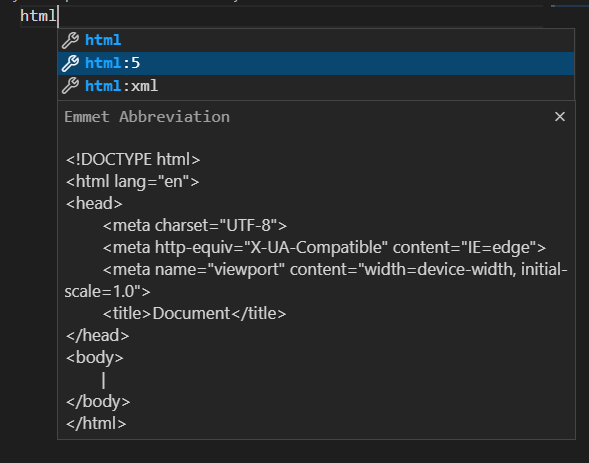
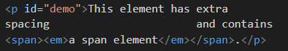
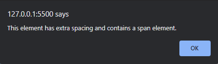
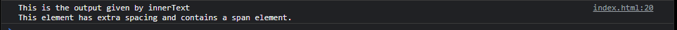
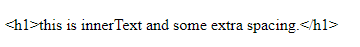
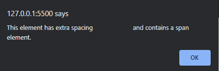
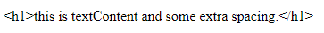
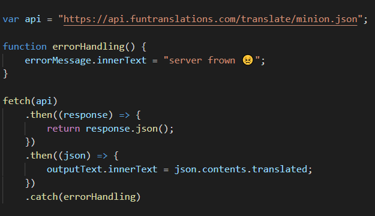

# JavaScript in the Browser
## Introduction
### History
- Due to browser inconsistency, people started using jQuery everywhere for even simpler programs and it provided a common interface to every browser. Few well-known companies then wanted to follow a common standard. They formed a group and decided to create a standard which will work on all browsers.Thus, JavaScript ( earlier known as mocha ) was created.
- Now, JavaScript works on almost all modern browsers

### JavaScript 
- JavaScript is a text-based dynamic programming language which can be used on both client-side and server-side. It can change the HTML and CSS of a webpage and also can calculate, manipulate and validate the data fetched from the webpage or from any source.
- It is written within the script tag.

### VanillaJS 
- VanillaJS is the purest form of JavaScript where no additional frameworks or libraries are used.

### Emmet 
- Emmet is a free add-on for your text editor that allows you to type shortcuts that are then expanded into full pieces of code.

### External vs Internal JS file
- If the Javascript code  is to be executed first or along with the HTML code then the js code is preferred to be written within script tag in the head tag
- Else, if two or more HTML files require same set of JS code, then it is preferred to create separate JS file and link the HTML pages via ‘src’ attribute

## DOM methods
### Event Listeners
- Event - Events represent the change in state of an element such that some activity is performed by the user or by the browser on the element. A case-sensitive string representing the [event type](https://developer.mozilla.org/en-US/docs/Web/Events) to listen for.
- The [EventListener]() interface represents an object that can handle an event dispatched by an EventTarget object
- For this purpose, first we’ll get the reference of the target element in JS file by querySelector() and then we’ll use

### querySelector()
- querySelector is a function that returns an element that matches a CSS selector. Note the querySelector method only returns the first instance of a selector
- querySelectorAll does the same function but it selects all the elements having the same css selector, in sequence of the element's occurrence. It returns a Nodelist
- More about <code>[querySelector()](https://developer.mozilla.org/en-US/docs/Web/API/Document/querySelector).</code>

### addEventListener()
- addEventListener calls a callback function when a certain event is triggered on the target element. 

### Callback function
- When a certain event happens we call a particular function to handle the event caught by addEventListener(), this function is a callback function.
- It is a function which is passed as an argument within another function.
- Example:
  <pre>var btnTranslate = document.querySelector(“#btn-translate”);
  // function to be called
    function clickHandler(){
    console.log(“clicked!”);
    };
    // callback to function
    btnTranslate.addEventListener(“click”,clickHandler)
</pre>

### Library
- It is a collection of packaged programs which are open to use for everyone.
- Example:
  - React is a library. We use react by using react’s library api like useState , setState, etc.

## DOM manipulation:
- When writing web pages and apps, one of the most common things you'll want to do is manipulate the document structure in some way. This is usually done by using the Document Object Model (DOM), a set of APIs for controlling HTML and styling information that makes heavy use of the Document object. Read more about [DOM manipulation](https://developer.mozilla.org/en-US/docs/Learn/JavaScript/Client-side_web_APIs/Manipulating_documents)

Let's take an example to understand the difference between innerText, innerHTML and textContent. 
The following is a snippet from a HTML file. 
   

### InnerText
- This property is used to write or retrieve the dynamic text on the HTML document
- If we try to modify the `<style>` of a certain element or wrap within any appropriate HTML elements dynamically using innerText (in JS file), the desired dynamic modifications will not be applied.
- It will read those changes as plain text and output them exactly as they are.
- However, if the text content is retrieved from an HTML file, its appearance is also retrieved, which means while we retrieve the text, it will be carrying the style applied as default.  

- *Note: innerText is easily confused with Node.textContent, but there are important differences between the two. Basically, innerText is aware of the retrieved appearance of text, while textContent is not.*

### textContent
- The textContent property sets or returns the text content of the specified node, and all its descendants, similar to innerText.
- textContent returns the text content of all elements, while innerText returns the content of all elements, except for `<script>` and `<style>` elements.
- textContent will return the text of elements that are hidden with CSS. 

### innerHTML
- The JavaScript innerHTML property sets the HTML contents of an element on a web page.
- It reads the HTML tags and applies the `<style>` mentioned in the dynamic text.
- innerHTML is used to print content between labels, including text information. Cross site security attacks are the main disadvantage of innerHTML.
- It retrieves and sets the same content in HTML format. 

  

- Alternative to create an element
  - Elements have two parts
    - Element node
    - Text node
  - document.createElement()
    - The createElement() method creates an element node.
    - This method returns an Element object.
  - document.createTextNode()
    - This method is used to create textNode with a specified text
    - When compared to innerHTML, it appends the dynamic text to existing text content that was initialised in the HTML rather than replacing it with the dynamic text.
  - insertBefore or appendChild
    - insertBefore
      - This approach adds the required newnode as a child node before the parent node's existing child node.
    - Appendchild
      - The appendChild() method appends a node as the last child of a node.

## Basic tools for JS

### Client - Server Architecture
- A centralized network architecture that classifies computer into two sections:
  - Client
    - Clients requests for or submits the data through the network with parameters included.
  - Server 
    - Servers are the response providers. It is a program which listens to the client’s request and responds to them. It's the place where we do heavy processing and store the data. Even Servers can act as Clients for database-servers.

### BaaS 
- A BaaS or mBaaS or Backend as a Service is a platform that automates backend side development, provides ready to use APIs, and manages the cloud infrastructure. A BaaS will allow you to connect your app frontend to the backend via APIs and SDKs.
- Eg. Firebase and AWS Amplify.

### Postman 
- Postman is an application used for API testing. It is an HTTP client that tests HTTP requests, utilizing a graphical user interface, through which we obtain different types of responses that need to be subsequently validated.
- Postman is a way to test a server and what output it gives based on input.
- On postman, select GET and then enter your url in the field given; you will be able to see the output.
- To give input to the server, we use the “Params” tab and provide the input to our server url. 
*Note: Browser sends only GET requests, so whenever we type in the search bar we send a “GET” request.*

## Concepts for API Calls:

### API
- It stands for Application Programming Interface
- We use this interface to program an application
- Many applications have their own functions which are useful. API helps us to communicate with those applications in order to program the application.
- Example: 
  `document.queryselector()` ➔ It helps us to connect with the document of the browser. 
  `addEventListener()` ➔ It is used to add an event to a html element. 

### fetch()
- Fetch allows you to make an HTTP request with a straightforward interface by using promises.
- It is used to call api in JS.
- By default we receive the response in the string format, we need to parse into JSON. 

- The `fetch` calls the api and gets the response and first `then` only converts response to json format and second `then` is used to console the responses.

### Arrow functions
- An arrow function expression is a compact alternative to a traditional function expression, but is limited and can't be used in all situations.
- Syntax: <pre>param => expression</pre>

### encodeURI()
- The encodeURI() function encodes a URI by replacing each instance of certain characters by one, two, three, or four escape sequences representing the UTF-8 encoding of the character (will only be four escape sequences for characters composed of two "surrogate" characters).
- URLs are designed to accept only certain characters in the standard 128-character ASCII character set. Reserved or unsafe ASCII characters which are not being used for their intended purpose, as well as characters not in this set, have to be encoded. URL encoding serves the purpose of replacing these non-conforming characters with a % symbol followed by two hexadecimal digits that represent the ASCII code of the character. 

### To handle errors : Use .catch()
- It takes a callback and error is passed to as an  argument to the callback.
- When the catch function is called then the error occurred is passed to this function and then the error is displayed using the callback function.

## Resources
- [Javascript Basics](https://developer.mozilla.org/en-US/docs/Learn/Getting_started_with_the_web/JavaScript_basics)
- [Learn Javascript](https://learnjavascript.online/)
- [DOM manipulation](https://developer.mozilla.org/en-US/docs/Learn/JavaScript/Client-side_web_APIs/Manipulating_documents)
- [Introduction to API](https://developer.mozilla.org/en-US/docs/Learn/JavaScript/Client-side_web_APIs/Introduction)