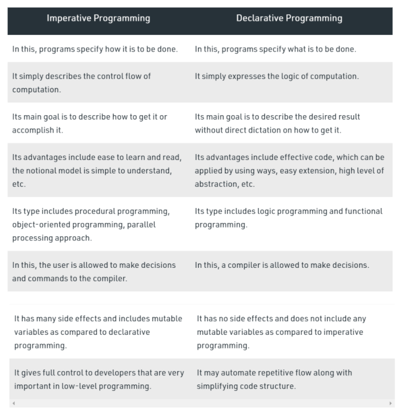
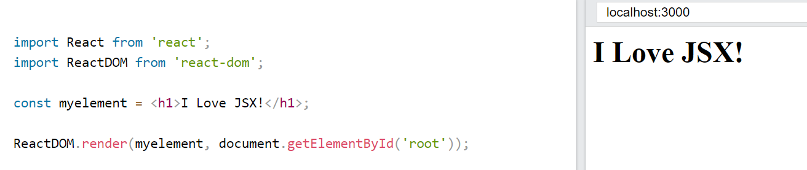
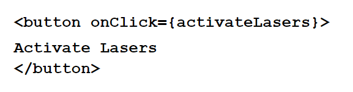
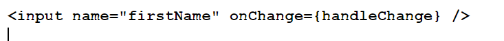
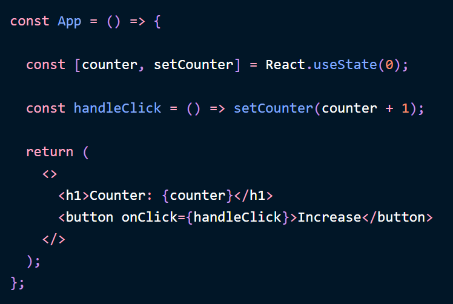
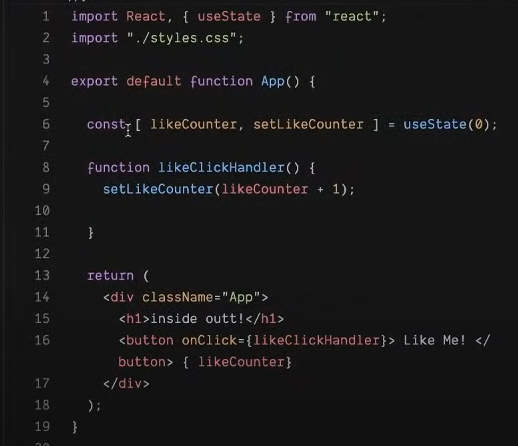
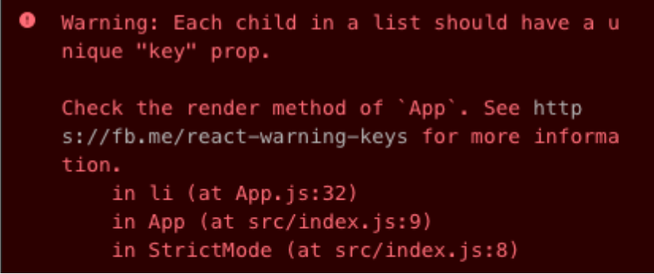
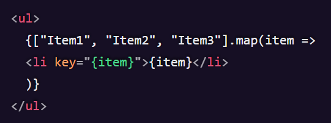
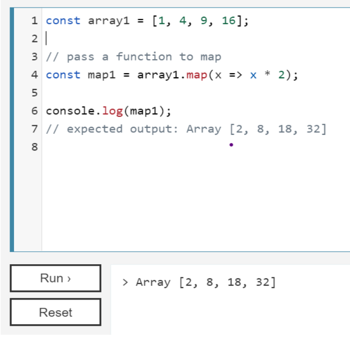

Introduction to ReactJS library

# What is react?

<h3>React is a JavaScript library for building user interfaces.</h3>

&nbsp;

> <h3>What is declarative?</h3>

- _Instead of telling how to do, just say what to do and it’ll be done._
- In react, the DOM is declarative. This means we never interact with DOM, the UI is updated when we change the state.
- This makes it easier to design UI and debug them, You can just change the program's state and see how the UI will look at that particular time.
    

> <h3>Difference between imperative and declarative</h3>
 

_Resource:_
https://www.geeksforgeeks.org/difference-between-imperative-and-declarative-programming/

 

> <h3>What is component-based?</h3>

- Components are one of the basic building blocks of React, and they represent classes or functions that accept input and render the various HTML elements
- Components are in purpose as JavaScript functions, but work in isolation and return HTML.

 

> <h3>What does it mean by is learn once, write anywhere?</h3>

- One can develop new features in React without rewriting existing code.
React can also render on the server using Node and power mobile apps using <a href="https://reactnative.dev/">React Native</a>.

 

> <h3>Useful tools for practicing react</h3>

1. <a href="https://reactide.io/">Reactide</a>
2. <a href="https://reactcosmos.org/">React cosmos</a>
3. <a href="https://www.reactsight.com/">React sight</a>
4. <a href="https://storybook.js.org/">Storybook</a>
5. <a href="https://codesandbox.io/">Codesandbox</a>
6. <a href="https://bit.dev/">Bit</a>
7. <a href="https://evergreen.segment.com/">Evergreen</a>

&nbsp;

# What is JSX?

- JSX stands for JavaScript XML.
- It is a syntax extension of JavaScript.
- It is faster than normal JavaScript as it performs optimization while translating to normal JavaScript.
- JSX allows us to write HTML elements in JavaScript and place them in the DOM without any createElement() and/or appendChild() methods.
- JSX converts HTML tags into react elements.

EXAMPLE :

 
 
&nbsp;

# Event Listeners

> <h3>onClick</h3>

It triggers a function with a click.

Example:

<pre>

Here, once the user clicks on the button, then function ‘activateLasers’ is called
</pre>

> <h3>onChange</pre>

If there is a change in the input, then a funtion is triggered.

<pre>

Here, if there is a change in the input field, then the function ‘handleChange’ is called.
</pre>

&nbsp;

# Callback functions

A callback function is a function passed into another function as an argument, which is then invoked inside the outer function to perform the given instructions.

Example:

<pre>
function greeting(name) {
  alert('Hello ' + name);
}

function processUserInput(callback) {
  var name = prompt('Please enter your name.');
  callback(name);
}

processUserInput(greeting);

</pre>

&nbsp;

# useState

- useState() is a built-in function that can be imported from the React library.
- useState() returns an array. The first parameter in the array is the current state value. The second parameter is the function that will allow you to update the state value.
- It accepts an argument which is the initial value of the first parameter.

  Example:
  

&nbsp;

# V I S E R
V --> View

I --> Interact

SE --> State in Event handler

R --> Render

 
In the above example, our view is the div in which HTML is present. 
we interact with the view using onClick then we update the state in event handler, and then we render the current state value on HTML. 

&nbsp;

# Object.keys()

The Object.keys() method returns an array of a given object's own enumerable property names, iterated in the same order that a normal loop would.

Syntax:

<pre>
Object.keys(obj)
</pre>

Example:

<pre>
// simple array
const arr = ['a', 'b', 'c'];
console.log(Object.keys(arr)); // console: ['0', '1', '2']

// array-like object
const obj = { 0: 'a', 1: 'b', 2: 'c' };
console.log(Object.keys(obj)); // console: ['0', '1', '2']

// array-like object with random key ordering
const anObj = { 100: 'a', 2: 'b', 7: 'c' };
console.log(Object.keys(anObj)); // console: ['2', '7', '100']
Note: If the keys of an object are strings, then it returns an array in the given sequence but, if the keys are numbers then it returns the array in ascending order
</pre>

Resource:
https://developer.mozilla.org/en-US/docs/Web/JavaScript/Reference/Global_Objects/Object/keys

&nbsp;

# Array

- JavaScript arrays are used to store multiple values in a single variable.
- It is a common practice to declare arrays with the const keyword.
- Arrays are a special type of objects.
- The typeof operator in JavaScript returns "object" for arrays

> <h3>Creating an Array</h3>

Using an array literal is the easiest way to create a JavaScript Array.

Example:

<pre>
const flowers = [rose, jasmine, sunflower];
</pre>

&nbsp;

# Warning: Each child in a list should have a unique **key** prop</h3>

  

> <h3>Why does React need this key prop? 🔑</h3>

- Keys help React identify which items have changed, are added, or are removed.
- Keys should be given to the elements inside the array to give the elements a stable identity. 

 
_Resource:_
https://medium.com/swlh/understanding-the-importance-of-the-key-prop-in-react-f2b92ce65f45

> <h3>Map function</h3>

- The map() method creates a new array with the results of calling a function for every array element.
- The map() method calls the provided function once for each element in an array, in order.
- map() does not execute the function for empty elements.
- map() does not change the original array.
    

&nbsp;

# Arrow functions

Arrow functions were introduced in ES6.
Arrow functions allow us to write shorter function syntax:

Normal Function:

<pre>
hello = function() {
  return "Hello World!";
}
</pre>

Arrow Function::

<pre>
hello = () => {
  return "Hello World!";
}
</pre>

It gets shorter! If the function has only one statement, and the statement returns a value, you can remove the brackets and the return keyword:

Example:
<pre>
hello = () => "Hello World!";
</pre>

If you have parameters, you pass them inside the parentheses:
Example:

<pre>
hello = (val) => "Hello " + val;
</pre>

In fact, if you have only one parameter, you can skip the parentheses as well:
Example:

<pre>
hello = val => "Hello " + val;
</pre>

&nbsp;

# Know more:

<a href="https://reactjs.org/">ReactJs</a>
<a href="https://developer.mozilla.org/en-US/docs/Web/JavaScript/Reference/Global_Objects/Object/keys">OBject.keys()</a>
<a>

https://reactjs.org/docs/components-and-props.html

https://reactjs.org/docs/hooks-state.html
