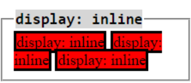
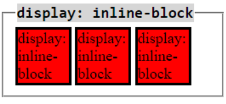
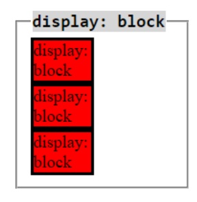
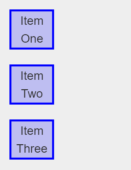
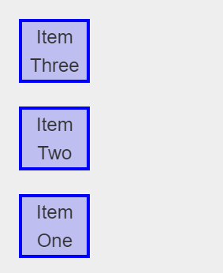
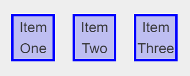
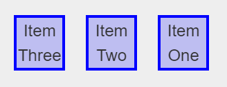
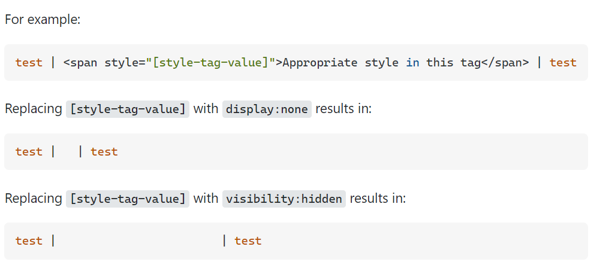

# Mark 10: Build Your Own Cash Register

### What is the purpose of `<label>` before `<input>`?
- Semantic HTML - Good practice to write code as some people use screen readers to understand the code (accessibility) and using label will be convenient for screen readers to give meaning to the input
- `for = ""` - connects with the `<input>`, states the purpose of input.

### What is the purpose of `<caption>`?
- Semantic HTML - `<caption>` defines the title of a table in the HTML document. Captions are rendered before the table.

## CSS `display` property
<pre> display : inline;</pre>
- Allows other elements to sit beside itself, doesn’t force a line break. Any height and width properties will have no effect. 
    
<pre>display : inline-block;</pre>
- Displays an element as an inline-level block container. The element itself is formatted as an inline element, but you can apply height and width values. 
    	
<pre>display : block;</pre>
- Displays an element as a block element (like `
`). It starts on a new line, and takes up the whole width. 
    	
<pre>display : flex;</pre>
- Displays an element as a block-level flex container. 
    <pre>flex-direction : column;</pre>
    - We then use flex-direction: column to set the axis to be vertical. 
    	
    <pre>flex-direction : column-reverse;</pre>
    - We then use flex-direction: column-reverse to set the axis to be vertical but the contents will be displayed in the reverse order. 
    	
    <pre>flex-direction : row;</pre>
    - We then use flex-direction: row to set the axis to be horizontal. 
    	
    <pre>flex-direction : row-reverse;</pre>
    - We then use flex-direction: row to set the axis to be horizontal but the contents will be displayed in the reversed order. 
    	
<pre>display: none;</pre>
- this property is commonly used in JavaScript to hide and show elements without deleting and recreating them.
- Thus, the element is not displayed at all
- To have an element take up the space that it would normally take, but without actually rendering anything, use the `visibility` property instead.

### `display` vs `visibility` property 
- `display:none;` means that the tag in question will not appear on the page at all (although you can still interact with it through the dom). 
- There will be no space allocated for it between the other tags.
- `visibility:hidden;` means that unlike `display:none;`, the tag is not visible, but space is allocated for it on the page. The tag is rendered, it just isn't seen on the page. 
  
  
