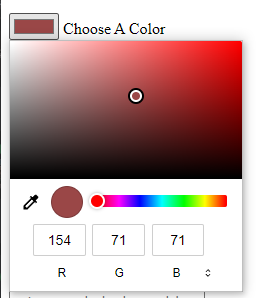

# Mark 11: Is your birthday lucky?
## Purpose of `
` in HTML 
### What is a `
`?
- It is a container that is used to group the content together
- Non-Semantic HTML - does not represent anything 
- Can be styled using the class and id attributes
### When to use a `
`?
- The `
` element should only be used when no other semantic element (such as `<article>` or `<nav>`) is appropriate.

[More about `
`](https://developer.mozilla.org/en-US/docs/Web/HTML/Element/div#attributes)

## Types of input
- The input element is used to accept data from the user and how an input works varies depending upon the value of its type attribute. 
- If the type attribute is not specified, the default type adopted is text.
- `<input>` types  
    [`<input type="button">`](https://developer.mozilla.org/en-US/docs/Web/HTML/Element/input/button)
    - `type="button"` are rendered as simple push buttons. 
         

    [`<input type="checkbox">`](https://developer.mozilla.org/en-US/docs/Web/HTML/Element/input/checkbox)
    - `type="checkbox"` are rendered by default as boxes that are checked (ticked) when activated. 
         

    [`<input type="color">`](https://developer.mozilla.org/en-US/docs/Web/HTML/Element/input/color)
    -  `type="color"` provide a user interface element that lets a user specify a color, either by using a visual color picker interface or by entering the color into a text field in #rrggbb hexadecimal format. 
         

    [`<input type="date">`](https://developer.mozilla.org/en-US/docs/Web/HTML/Element/input/date)
    -  `type="date"` create input fields that let the user enter a date, either with a textbox that validates the input or a special date picker interface. 
         

    [`<input type="datetime-local">`](https://developer.mozilla.org/en-US/docs/Web/HTML/Element/input/datetime-local)
    -  `type="datetime-local"` create input controls that let the user easily enter both a date and a time, including the year, month, and day as well as the time in hours and minutes. 
         

    [`<input type="file">`](https://developer.mozilla.org/en-US/docs/Web/HTML/Element/input/file)
    -  `type="file"` let the user choose one or more files from their device storage. 
        

    [`<input type="hidden">`](https://developer.mozilla.org/en-US/docs/Web/HTML/Element/input/hidden)
    -  `type="hidden"` let web developers include data that cannot be seen or modified by users when a form is submitted 
        

    [`<input type="image">`](https://developer.mozilla.org/en-US/docs/Web/HTML/Element/input/image)
    -  `type="image"` are used to create graphical submit buttons, i.e. submit buttons that take the form of an image rather than text. 
        

    [`<input type="number">`](https://developer.mozilla.org/en-US/docs/Web/HTML/Element/input/number)
    -  `type="number"` are used to let the user enter a number. They include built-in validation to reject non-numerical entries. 
         

    [`<input type="password">`](https://developer.mozilla.org/en-US/docs/Web/HTML/Element/input/password)
    -  `type="password"` provide a way for the user to securely enter a password. 
         

    [`<input type="radio">`](https://developer.mozilla.org/en-US/docs/Web/HTML/Element/input/radio)
    -  `type="radio"` are generally used in radio groups—collections of radio buttons describing a set of related options. 
         

    [`<input type="submit">`](https://developer.mozilla.org/en-US/docs/Web/HTML/Element/input/submit)
    -  `type="submit"` are rendered as buttons. When the click event occurs (typically because the user clicked the button), the user agent attempts to submit the `form` to the server. 
        

    [`<input type="text">`](https://developer.mozilla.org/en-US/docs/Web/HTML/Element/input/text)
    -  `type="text"` create basic single-line text fields. 
        

### When to use `class` and when to use `id`?
- `class` is like a type of the item whereas `id` is like a unique code assigned to the item.
- `class` is useful when you have, or possibly will have in the future, more than one element that shares the same `style`.
- use `id` when you have a single element on the page that will take the `style`.  

### replace / replaceAll in JavaScript
- `replace()`
    - The `replace()` method searches a string for a value or a regular expression.
    - The `replace()` method returns a new string with the value(s) replaced.
    - It replaces only the first occurrence of the matched substring.
    - Syntax:
        <pre>string.replace(valueToBeReplaced, newValue);</pre>
    - Example:
        <pre>
      var text = “first come first serve”;
      console.log(text.replace(“first,”second”));
      Output : 
      second come first serve
    </pre>
- `replaceAll()`
    - This method replaces all the occurrences of a matched substring with a new string 
    - Syntax: 
        <pre>string.replaceAll(searchString, replaceString)</pre>

    - Example:
        <pre>
      var text = “first come first serve”;
      console.log(text.replaceAll(“first,”second”));
      Output : 
      second come second serve</pre>

<i>tip : write your own version of replaceAll (good for interview practice)</i>

### `length` property in JavaScript
- The `length` property returns the length of a string.
- Example :
    <pre>
    var text = "NeogCamp";
    console.log(text.length);
    Output:
    8</pre>

### `charAt()` method in JavaScript
- The `charAt()` method returns the character at a specified index (position) in a string.
- Example :
    <pre>
    var text = “Neog”;
    console.log(text.charAt(1));
    Output:
    e</pre>
 
### Typecasting in Javascript
- Converts datatype of a variable
- Converting Strings to Numbers
    - `Number()` : Returns a number, converted from its argument
    - `parseInt()` : parses a string and returns a floating point number.
    - `parseFloat()` : parses a string and returns an integer.

- Converting Numbers to Strings
    - `String()` method can convert numbers to strings.
    - `String(123)`       // returns a string from a number literal 123
    - `toString()` method does the same
    - More methods:
    
- Converting Booleans to Numbers
    - The method `Number()` can also convert booleans to numbers.
    - `Number(false)`     // returns 0
    - `Number(true)`      // returns 1
    
- Converting Booleans to String
    - The method String() can convert booleans to strings.
    - `String(false)`	  // returns "false"
    - `String(true)` 	  // returns "true"

### Types of `for` loop in JavaScript
- for
    - for (initialExpression; conditionExpression;incrementExpression){
    //code to be executed
    }
    - Example:
        <pre>for(var i=0; i<5; i++) {
            console.log(i);
        }
        Output:
        0
        1
        2
        3
        4</pre>
    

- for/in
    - for (variable in object) {
    //code to be executed
    }
    - Example :
        <pre>var cart = {"itemOne": "milk","itemTwo": "bread","itemThree": "eggs"};
        for(item in cart){
        console.log(item+" = "+cart[item]);
        }

        Output :
        itemOne = milk
        itemTwo = bread
        itemThree = eggs</pre>

 
- for/of
    - for(variable in array){
    //code to be executed
    }
    - Example :
        <pre>var cart = ["milk","eggs","bread"];
        for(item of cart){
        console.log(item);
        }
        Output:
        milk
        Eggs
        bread</pre>

### Why `===` is faster than `==` in JavaScript?
- `===` compares if the values and the data types are the same.
`==` compares if the values are the same, but it also does type conversions in the comparison. 
Those type conversions make `==` slower than `===`.

### `disabled` attribute in HTML
- Indicates whether the user can interact with the element or not.
Can be applied to `<button>`, `<command>`, `<fieldset>`, `<input>`, `<keygen>`, `<optgroup>`, `<option>`, `<select>`, `<textarea>` tags.
- <a href="https://developer.mozilla.org/en-US/docs/Web/HTML/Attributes">More about HTML attributes</a>

