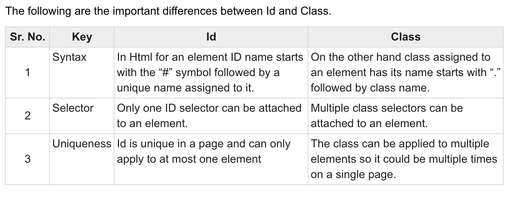
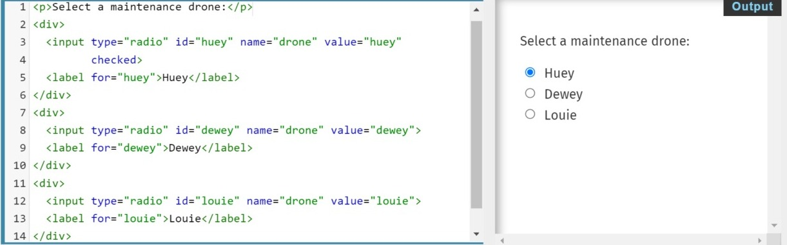
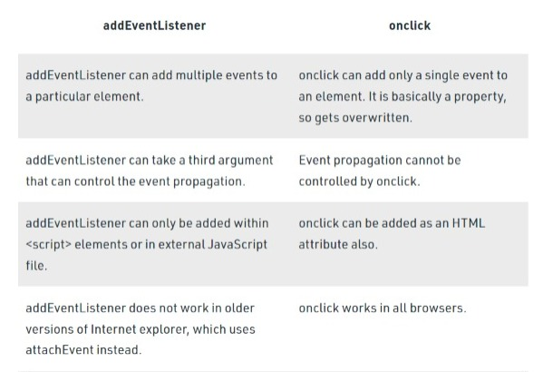
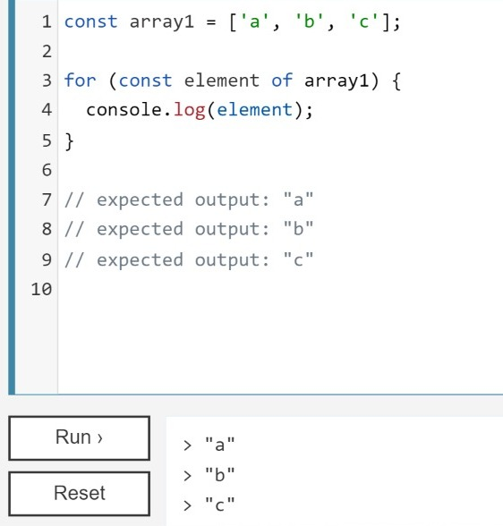
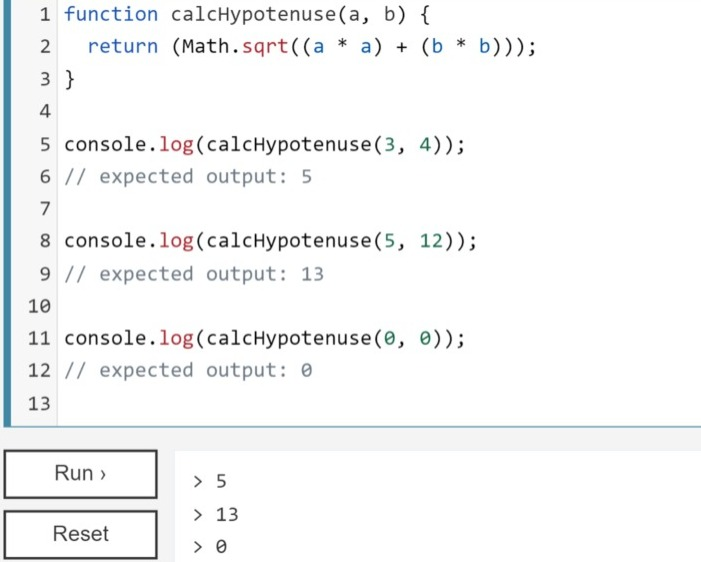

# Fun With Triangles 

## Class and id
for selection and to perform certain tasks in javaScript , we assign each element in Html with a class or an id.

> What is `class` ?
- A `class` is an attribute which is used to specify the class names for various Html elements. A class can be same for certain elements.
- Syntax 
    ```
    <element class="class_name">
    In CSS Stylesheet:
    .class {
        // CSS Property
    }
    ```

> What is `id` ?
- An `id` is an attribute which is used to specify an unique html element. An id should be unique for every element. 
- Syntax 
    ```
    <element id="id_name">

    In CSS Stylesheet:
    #id_name {
        // CSS Property
    }
    ```

> Class Vs Id <br>



<br>
</br>
<br>

## querySelectorAll and querySelector 

- To select an html element and perform certain tasks on it we use query selectors.<br>

>[querySelector()]()
- It is used to select **a particular html element** by its class or id so that we can perform different tasks on it. 
- Syntax
    ```
    element = document.querySelector("#selectors");
    ```

>[querySelectorAll()]()
- It is used to select **multiple html elements** which are grouped under same class by their class name so that we can perform different tasks on them.
- *Note: We use index notation for selecting different elements of same class.*
- Syntax 
    ```
    element = document.querySelectorAll(".selectors");
    ```
>**querySelector() Vs querySelectorAll()**
- The `querySelector()` method can only access a single element, whereas the `querySelectorAll()` method can access all elements that match a specified selector. 
- To return all matches, *querySelectorAll* must be used, whereas *querySelector* is used to return a single match.

<br>
</br>
<br>

## form
- The HTML element `<form>` represents a section of a document that contains interactive controls for submitting information.
- Eg:


>`formdata `

- A `formData` is nothing but a web API that acts as constructor which creates a formData object. 

- Syntax 
    ```
    new FormData(form)
    ```
- Example: 
    ```
    var formData = new FormData(); // Currently empty 
    ```

>entry in formdata(key-value pair)
- The `FormData.entries()` method returns an iterator that allows you to loop through all of the key/value pairs in this object.

- Syntax
    ```
    formData.entries();
    ```
*Note: If there is a button inside the form, after clicking the button the page gets refreshed.*

<br>
</br>
<br>

## Radio button 
* Radio buttons let a user select only one of a limited number of choices
- Syntax:
    ```
    <input type="radio">
    ```
- Eg:

    

> name:

The radio group must have share the same name (the value of the name attribute) to be treated as a group.
*In radio group to toggle between the options we name them same.*

> value:

The value attribute defines the unique value associated with each radio button. The value is not shown to the user, but is the value that is sent to the server on "submit" to identify which radio button was selected.

*Note: Always add the  `<label>`  tag for best accessibility practices!*

<br>
</br>
<br>

## addEventListener() and onclick()
The addEventListener() and onclick both listen for an event. Both can execute a callback function when a button is clicked. However, they are not the same.

* addEventListener(): The addEventListener() method attaches an event handler to the specified element.

* onclick(): The onclick event attribute works when the user clicks on the button. When the mouse is clicked on the element then the script runs.
<br></br>

> Difference between addEventListener() and onclick():


<br></br>

> Why use addEventListener() over onclick() in js?

    do not put html under js and js under html n hence we use addeventListener as that is the best practice

<br>
</br>
<br>

## for of
The for...of statement creates a loop iterating over iterable objects, including: built-in String, Array, array-like objects (e.g., arguments or NodeList), TypedArray, Map, Set, and user-defined iterables.

Here the iterator is the value itself and not the index.

* Syntax:
    ```
    for (variable of iterable) {
    statement
    }
    ```

- Eg:

    

<br>
</br>
<br>

## Math in js
Math is a built-in object that has properties and methods for mathematical constants and functions. It’s not a function object.

Math works with the Number type. It doesn't work with BigInt(whole numbers larger than 2^53 - 1).


* Square root

 returns the square root of a number

- Syntax:
    ```
    Math.sqrt()
    ```

- Example <br>

    

## *Know more:*

[formData](https://developer.mozilla.org/en-US/docs/Web/API/FormData/FormData)

[Math in js](https://developer.mozilla.org/en-US/docs/Web/JavaScript/Reference/Global_Objects/Math)

